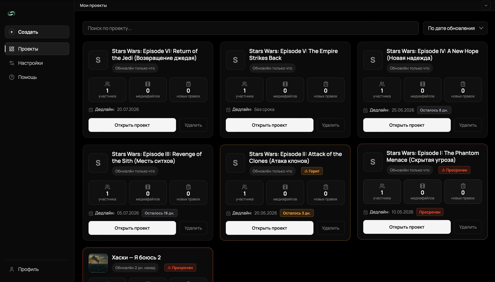
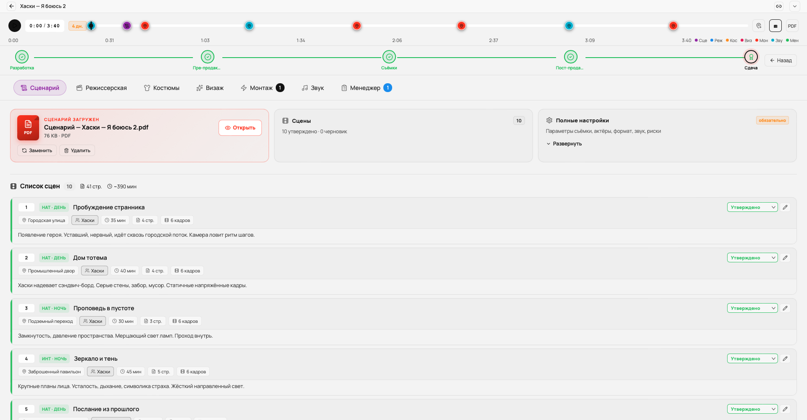
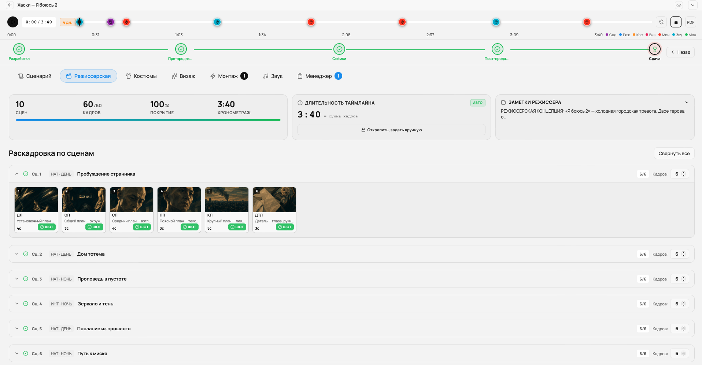
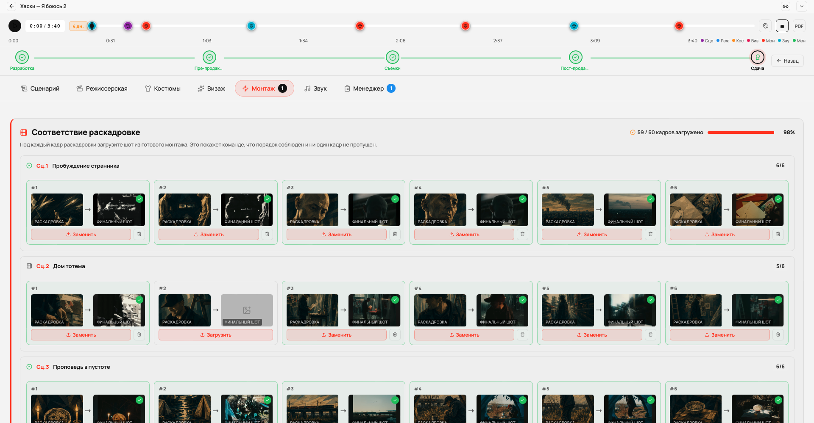
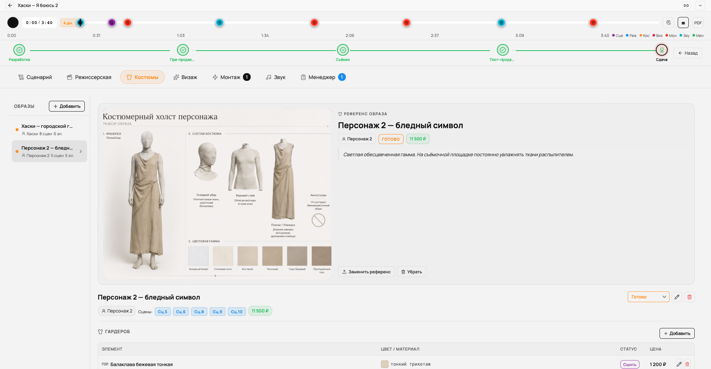
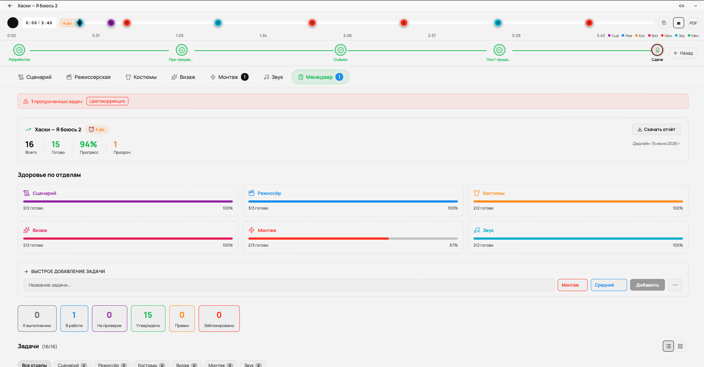

# SyncHub AV Pipeline

Веб-приложение для команды, которая снимает кино, клипы или ролики. Сценарист, режиссёр, костюмер, визажист, монтажёр, звукорежиссёр и продюсер работают в одном проекте: видят чужой прогресс, не дублируют данные, не теряют время в чатах.

[](#требования)
[](#стек)
[](#стек)
[](#стек)

---

## Зачем

Я начал это делать после того, как пару раз поучаствовал в небольших съёмках и увидел, как команда разваливается на куски. У сценариста — Google Docs, у режиссёра — стопка распечатанных раскадровок, костюмер списывает имена персонажей в Telegram-переписке, звукарь приходит на площадку и впервые видит сцены. Всё это работает, пока команда из трёх человек. Дальше начинаются «а кто это переслал», «а это какой вариант», «я думал у нас 8 кадров, а тут 10».

Готовые решения есть. StudioBinder, Yamdu, Celtx — это всё дорогие подписки, и каждая закрывает свой кусок. Trello слишком общий. Final Draft занимается только сценарием. Frame.io — только просмотр финального материала. Я хотел собрать всё в одном месте, с понятной фазовой моделью производства и нормальным разделением по отделам.

Это пет-проект. Я не строю стартап, я строю инструмент, которым сам хочу пользоваться, когда снимаю.

---

## Что внутри

**Семь вкладок под семь отделов.** У каждого свой экран, но данные общие. Сценарист создаёт сцену с персонажами — те же имена появляются в выпадающих списках костюмера и визажиста. Режиссёр раскладывает кадры — монтажёр получает их в порядке для сборки.

**Пять фаз производства**: Development → Pre-Production → Production → Post-Production → Delivery. Между фазами стоят условия: пока сценарист не заблокировал хотя бы одну сцену, остальные отделы открыты только на просмотр. Это не модно, но это снимает половину путаницы на старте.

**Музыкальный таймлайн** (для клипов и роликов). Звукарь грузит трек, режиссёр расставляет кадры раскадровки прямо на временной шкале — с точностью до секунды. Видно, что кадр №14 идёт на 0:43, длится 4 секунды, после него — №15. Когда я снимал свой первый клип, мы делали это в Excel. Это была боль.

**Соответствие раскадровке у монтажёра.** На каждый кадр режиссёрской раскадровки монтажёр загружает скриншот из готового монтажа. Режиссёр и сценарист видят прогресс кадр-в-кадр и понимают, что порядок соблюдён. Никто из коллег не знал, как такое называется, поэтому я назвал просто «соответствие».

**Все типы файлов** загружаются и открываются прямо в приложении. PDF сценария, DOCX, изображения референсов, MP3 трека, MP4 видео. Никаких скачиваний на диск, чтобы посмотреть.

---

## Скриншоты

Лежат в `screenshots/` (полные и пустые состояния всех вкладок). Ниже — прогон по основным экранам в демо-проекте.

| | |
|---|---|
|  |  |
|  |  |
|  |  |

---

## Стек

**Клиент:** React 18, TypeScript 5, Vite, react-router. Без UI-фреймворков — CSS-переменные и руками. Это сознательный выбор: я хочу контролировать каждый отступ.

**Сервер:** Node 20, Express, PostgreSQL 16 (с JSONB для гибких полей вроде раскадровки), pg-pool, helmet, multer для загрузок, bcrypt-подобное хеширование через `scryptSync`.

**Документация API:** Swagger UI на `/api/docs`.

**CI:** GitHub Actions — typecheck клиента, сборка, тесты сервера.

---

## Запуск локально

Нужен Node 20+ и PostgreSQL 16. На маке у меня всё ставится через `brew install postgresql@16 node@20`.

```bash
git clone https://github.com/Whytenko/SyncHub-AV-Pipeline.git
cd SyncHub-AV-Pipeline

# БД
createdb synchub_dev

# Сервер
cd server
cp .env.example .env          # отредактировать DATABASE_URL
npm install
npm run migrate
npm run dev                   # :5001

# Клиент в отдельном окне
cd ../client
npm install
npm run dev                   # :5173
```

Дальше открыть `http://localhost:5173`. Если завёл миграции, есть демо-пользователь `demo@example.com` / `demo1234`.

---

## Структура

```
client/
├── src/
│   ├── api/              fetch-обёртки, asset resolver
│   ├── components/       общие: Modal (через portal), FilePreview, ImageLightbox
│   ├── context/          Auth, Toast, I18n, Hints
│   ├── pages/
│   │   ├── Project/
│   │   │   ├── components/   SceneManager, ShootingCalendar, FramePairViewer, MusicClipTimeline
│   │   │   └── tabs/         семь вкладок отделов
│   │   └── …
│   └── types.ts
server/
├── src/
│   ├── db.js             mapProject, helpers
│   ├── pool.js           pg-pool
│   ├── validate.js       чистый валидатор PATCH-запросов
│   └── swagger.js
├── migrations/           001..005 sql-файлы
├── scripts/              migrate.js, seed_husky.js
└── index.js              точка входа, монтаж роутов
```

---

## База данных

Пять миграций:

```
001_init.sql              users, sessions, projects
002_pipeline.sql          production_stage, scenes, shooting_days
003_project_roles.sql     project_roles (per-project)
004_project_kind_music.sql project_kind, audio_track_id, music_timeline
005_bigint_audio_track.sql audio_track_id INTEGER → BIGINT
```

История миграций показывает, как проект эволюционировал. Пятая, например, — последствие того, что `Date.now()` не помещается в `INTEGER` в Postgres. Я столкнулся с этим в проде локального демо, починил, оставил в истории.

---

## Безопасность

- Пароли хешируются через `scryptSync` с 16-байтной солью и 64-байтным ключом.
- Сессии хранятся в БД, не в cookie. У клиента — токен, у сервера — записи с TTL.
- Все PATCH-запросы проходят через `validate.js`. Поле, которого нет в whitelist, просто не доходит до БД. На клиенте об этом помнить не надо, но я об этом помню.
- `helmet` ставит security-headers. На `/uploads` CSP снят руками, потому что иначе iframe-просмотр PDF с другого origin не работает в Chrome.
- Параметризованные SQL-запросы везде. Никакой конкатенации.

Что я ещё не сделал и помню об этом: CSRF-токены, rate limit на login (сейчас глобальный, не по IP+email).

---

## API

Краткий справочник — полный в Swagger:

```
POST   /api/auth/register
POST   /api/auth/login
GET    /api/auth/me
POST   /api/auth/logout

GET    /api/projects
POST   /api/projects
GET    /api/projects/:id
PATCH  /api/projects/:id
DELETE /api/projects/:id

POST   /api/projects/:id/media/upload
DELETE /api/projects/:id/media/:mediaId

POST   /api/projects/:id/documents/upload
DELETE /api/projects/:id/documents/:docId

POST   /api/projects/:id/script/upload
PUT    /api/projects/:id/role
POST   /api/projects/:id/members
```

`PATCH /api/projects/:id` принимает почти всё, что можно поменять в проекте: сцены, задачи, костюмы, гримы, маркеры, музыкальный таймлайн. Валидация серверная.

---

## Тёмная и светлая темы

Через CSS-переменные. Свет — это не «инверсия», это отдельный набор цветов, подобранный руками. Если включить инверсию, текст становится коричневатый, а градиенты ломаются. Я проверял.

---

## i18n

Русский, английский, китайский. Перевод через `useI18n()` и словарь. Локализация — это правда боль: после каждого рефакторинга добавляются новые строки, и их забываешь перевести. Я веду список «непереведённого» в issues.

---

## Что дальше

- Реальная коллаборация через WebSocket (сейчас обновления только при перезагрузке вкладки).
- Экспорт проекта в PDF — для печатной раздаточки на площадке.
- Интеграция с Frame.io для просмотра видео.
- Мобильное приложение — хотя бы read-only режим для съёмочной группы на площадке.

Подробнее — [ROADMAP.md](ROADMAP.md).

---

## Лицензия

ISC. Берите код, ломайте, делайте лучше.
